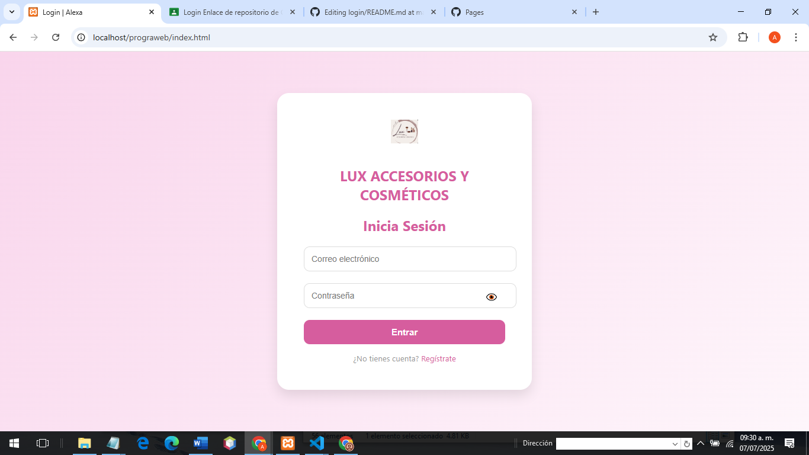
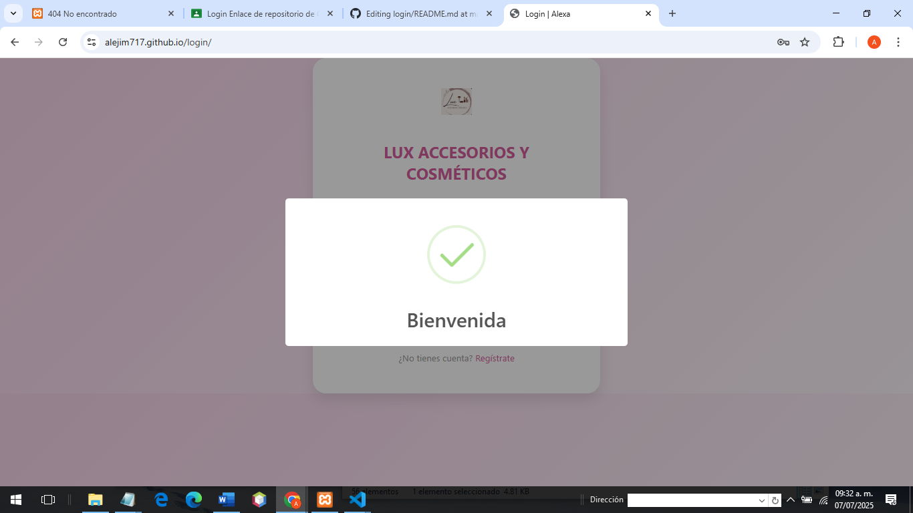
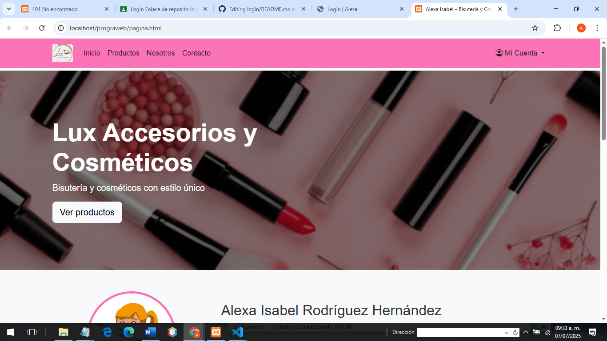
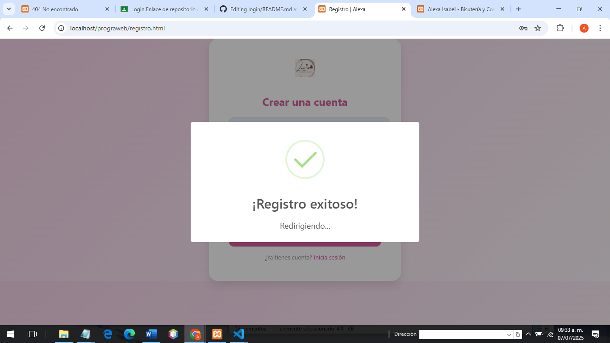

# Login

## Descripción del Proyecto

Este login tiene como objetivo reforzar y demostrar nuestros conocimientos. Utiliza la librería **SweetAlert2** para mostrar mensajes

## Estructura del Proyecto

El sistema está compuesto por los siguientes archivos:

- index.html: estructura principal del formulario de inicio de sesión.
- login.css: para almacenar lo referente a diseño .
- Librería externa: SweetAlert2 para notificaciones visuales.

  **Validación de correo electrónico:**  
  Se utiliza una expresión regular para verificar que el formato del correo ingresado sea válido.

  **Verificación de contraseña:**  
  Se valida que la contraseña tenga una longitud mínima definida (por ejemplo, 6 caracteres).

  **Mostrar/ocultar contraseña:**  
  Se incluye una función para alternar la visibilidad del campo de contraseña mediante un ícono interactivo.

  **Manejo del formulario:**  
  Al enviar el formulario, si los datos son válidos, se muestra una alerta de bienvenida y se redirige a otra página. Si no, se notifica al usuario con mensajes de error amigables usando una librería de notificaciones.

###  Estilos

**Diseño centrado:**  
  El formulario está centrado vertical y horizontalmente usando `flexbox`.

 **Colores:**  
  Colores suaves, bordes redondeados, sombras suaves y uso de tipografías legibles.

 **Botón de acción:**  
  Botón de inicio de sesión con estilos atractivos, efectos al pasar el cursor y diseño responsivo.

 **Enlace a registro:**  
  Enlace estilizado hacia una página de registro, ubicado al final del formulario.

### Imagenes del Funcionamiento

